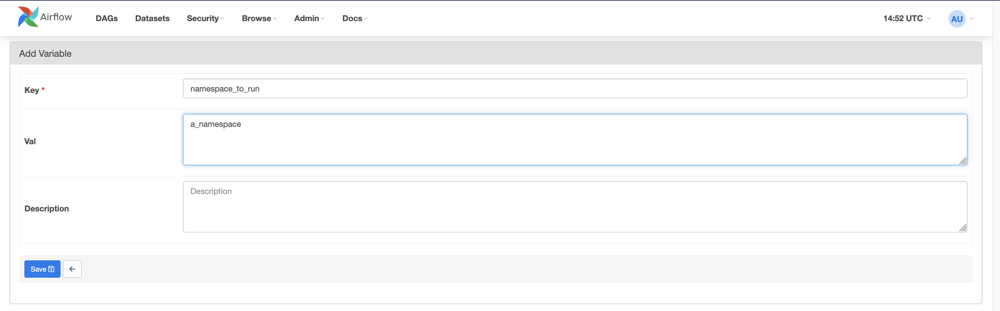
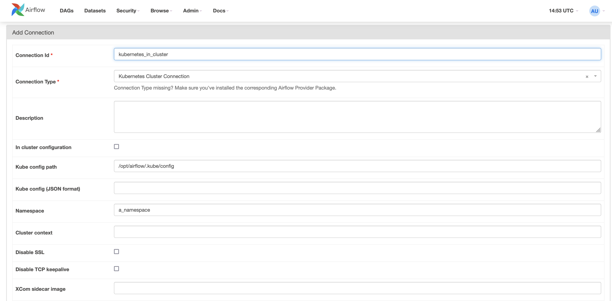

# Gbif-airflow-dags
This repsitory containing the DAGs and plugins used in Airflow installation in GBIF. We are relying on the images and operators provived by [Stackable](https://docs.stackable.tech).

## DAGs
The dags are synced into Airflow through the git-sync program installed in the Airflow image. The program is configured to fetch the head of a specfic branch. 

As an quick overview, the following list describes the environment and which branch they env should be fetching from:

| Envrionment   | Branch    |
| ------------- | --------- |
| Dev2          | develop   |

**NOTE:** To fully determine which branch an environment is currently syncing, consult the gbif-airflow values.yaml to check the latest branch used or the airflow object within the namespace.

## Plugins
The plugin folder is build into the official Stackable airflow image as an extension with the plugins located in the Airflow installation. The dockerfile, describing the extention, is located in the gbif-docker-images repository.

## Local Testing
A way to test the dags locally is to start a local instance of Airflow with the folder mounted to properly location in the Airflow installation. This can be achieved quite effortlessly with Docker. Running the following will start the official airflow image locally with DAGs, plugins and kube folders mapped into the container enabling local testing within a Kubernetes cluster of your choice.

```
docker run -d -v <path_to_directory_containing_git_repositories>/gbif-airflow-dags/dags:/opt/airflow/dags -v <path_to_directory_containing_git_repositories>/gbif-airflow-dags/plugins:/opt/airflow/plugins -v $HOME/.kube:/opt/airflow/.kube -p 8080:8080 apache/airflow:2.6.1 standalone
```

An example of how the command could look.

```
docker run --name my_awesome_container -d -v $HOME/workspace/repos/gbif-airflow-dags/dags:/opt/airflow/dags -v $HOME/workspace/repos/gbif-airflow-dags/plugins:/opt/airflow/plugins -v $HOME/.kube:/opt/airflow/.kube -p 8080:8080 apache/airflow:2.6.1 standalone
```
With command above running, the Airflow Portal should be available on the localhost:8080. The admin password for the local Airflow instance can be extracted from the pod with:

```
docker exec my_awesome_container /bin/bash -c "cat /opt/airflow/standalone_admin_password.txt; echo \n"
```

If you haven't given the container a name, the auto generated name can be found with ```docker ps```. First time accessing the portal there were be a few warnings / errors but it is expected as two configurations are still missing.

First create the variable that contains the namespace to use:



Secondly create the kubernetes connection for Airflow to use:



***NOTE! As Airflow uses your local kube config, it is your account that is used. Do not build the file into an image that is pushed or execute DAGs your aren't familier with.***

As the standard image doesn't contain the Trino provider, two of the example DAGs will still show as failing.